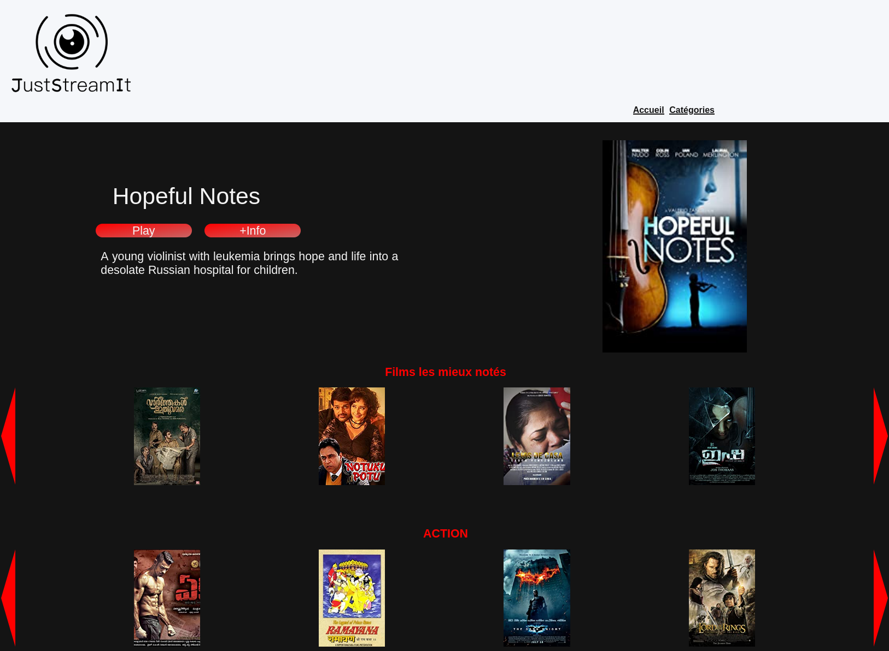
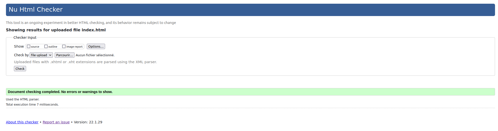
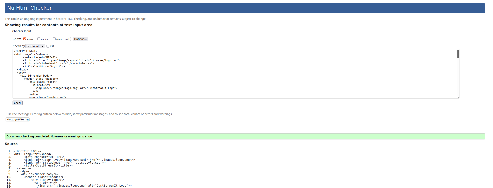
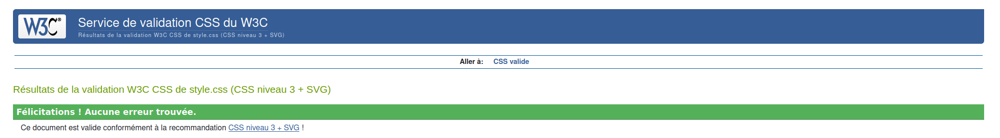

# DA_Python_P06 - Développez une interface utilisateur pour une application web Python

Développez une interface utilisateur pour une application web Python

# Table des matières<a name="Table_of_Contents"></a>
- [DA_Python_P06 - Développez une interface utilisateur pour une application web Python](#da_python_p06---développez-une-interface-utilisateur-pour-une-application-web-python)
- [Table des matières<a name="Table_of_Contents"></a>](#table-des-matières)
  - [INTRODUCTION <a name="INTRODUCTION"></a>](#introduction-)
  - [Objectifs du projet <a name="objectifs"></a>](#objectifs-du-projet-)
  - [FEATURES <a name="FEATURES"></a>](#features-)
  - [REQUIREMENTS <a name="REQUIREMENTS"></a>](#requirements-)
    - [Récupération du projet <a name="Recup_projet"></a>](#récupération-du-projet-)
    - [Récupération et installation de l'API de test de OCMovies  <a name="API_OCMovies"></a>](#récupération-et-installation-de-lapi-de-test-de-ocmovies--)
  - [Comment utiliser le site web en local <a name="How_to_use"></a>](#comment-utiliser-le-site-web-en-local-)
  - [Screenhot du site web <a name="Exemple_affichage_menu"></a>](#screenhot-du-site-web-)
  - [Arborescence du projet <a name="Tree_project"></a>](#arborescence-du-projet-)
  - [Résultat du validateur W3C HTML sur la page "index.html" non chargée <a name="Validateur_HTML_no_charged"></a>](#résultat-du-validateur-w3c-html-sur-la-page-indexhtml-non-chargée-)
  - [Résultat du validateur W3C HTML sur la page "index.html" chargée <a name="Validateur_HTML_index"></a>](#résultat-du-validateur-w3c-html-sur-la-page-indexhtml-chargée-)
  - [Résultat du validateur W3C CSS sur le code CSS <a name="Validateur_CSS"></a>](#résultat-du-validateur-w3c-css-sur-le-code-css-)
  - [Contact <a name="Contact"></a>](#contact-)


## INTRODUCTION <a name="INTRODUCTION"></a>

L’association JustStreamIt est connue pour ses newsletters de classement de films. Ces classements ont sauvé bien des soirées à ses abonnés toujours plus nombreux, comme le dit leur slogan : “Tu ne sais pas quoi regarder pour passer une bonne soirée ? Alors JustStreamIt”.
Mais le principe des newsletters commence à montrer ses limites. L’association souhaite se doter d’une application web permettant de visualiser en temps réel un classement de films intéressants.


## Objectifs du projet <a name="objectifs"></a>

L'objectif est d'offrir une solution à l’association JustStreamIt pour remplacer leur système de newsletters en un site web permettant de visualiser en temps réel un classement de films intéressants.
Le design du futur site web devra correspondre à la maquette ci-dessous, qui est inspirée de l’interface de Netflix.


[<div align="center">[Table of Contents]</div>](#Table_of_Contents) 

## FEATURES <a name="FEATURES"></a>

  - Le site fonctionne de façon similaire sur les trois navigateurs les plus utilisés actuellement.
  - Utilise une API maison baptisée OCMovies-API.
  - Récupére les données des films depuis l’API à l’aide de requêtes ajax et de les afficher sur une interface web.
  - Filtre les données en fonction de critères définis.
  - La mise à jour des données se fait automatiquement.
  - Afichage d'une zone du “Meilleur film” en haut de la page, cette zone affiche la photo du film qui a la meilleur note Imdb toutes catégories confondues, ainsi que son titre, un bouton et le résumé du film sous le bouton.
  - Affichage de la catégorie “Films les mieux notés” (correspond aux 7 films les mieux notés selon le score Imdb.
  - Affichage des catégories "Action", "Aventure", "Comédie", montre pour chaque catégorie les 7 films les mieux noté d’une catégorie donnée.
  - Lorsqu’on clique sur le bouton du film en vedette ou sur l’image d’un des films une fenêtre modale s’ouvre avec les informations concerant le film.
  


[<div align="center">[Table of Contents]</div>](#Table_of_Contents)

## REQUIREMENTS <a name="REQUIREMENTS"></a>
  - Pour le bon fonctionnement, il faut récupérer l'API de test de OCMovies (une procédure plus bas vous donnera les information pour la récupération de l'API).
  - Il est recommander de récupérer le projet en utilisant "git clone" ou en téléchargeant directement le projet.
  - Une connexion internet fonctionnelle est nécessaire pour la partie installation.


### Récupération du projet <a name="Recup_projet"></a>

- Par téléchargement:
  
 lien de téléchargement : https://github.com/lahou-sys/DA_Python_P06/archive/refs/heads/master.zip

- Par "git clone":
  
```ssh
git clone https://github.com/lahou-sys/DA_Python_P06.git
```


[<div align="center">[Table of Contents]</div>](#Table_of_Contents) 


### Récupération et installation de l'API de test de OCMovies  <a name="API_OCMovies"></a>

- Lien Github
  
  https://github.com/OpenClassrooms-Student-Center/OCMovies-API-EN-FR

Cette API exécutable localement peut être installée en suivant les étapes décrites ci-dessous. L'usage de pipenv est recommandé. Si pipenv n'est pas encore installé sur votre ordinateur, vous trouverez des instuctions d'installation détaillées.


1. Cloner ce dépôt de code à l'aide de la commande

```ssh
$ git clone clone https://github.com/OpenClassrooms-Student-Center/OCMovies-API-EN-FR.git
```
 
- Vous pouvez également télécharger le code en temps qu'archive zip en suivant le lien suivant :
  
  https://github.com/OpenClassrooms-Student-Center/OCMovies-API-EN-FR/archive/refs/heads/master.zip

2. Rendez-vous depuis un terminal à la racine du répertoire ocmovies-api-fr avec la commande

```ssh  
$ cd ocmovies-api-fr
```
3. Installez les dépendances du projet à l'aide de la commande

```ssh
$ pipenv install
```

4. Créer et alimenter la base de données à l'aide de la commande

```ssh 
$ pipenv run python manage.py create_db
```
5. Démarrer le serveur avec 

```ssh 
$ pipenv run python manage.py runserver
```

Les étapes 1 à 4 ne sont requises que pout l'installation initiale. Pour les lancements ultérieurs du serveur de l'API, il suffit d'exécuter l'étape 5 à partir du répertoire racine du projet.

[<div align="center">[Table of Contents]</div>](#Table_of_Contents) 


## Comment utiliser le site web en local <a name="How_to_use"></a>

Après avoir récupérer le projet du site web et lancer l'API OCMovies.

Vous pouvez ouvrir avec un navigateur internet le fichier "index.html" depuis le dossier du projet.

[<div align="center">[Table of Contents]</div>](#Table_of_Contents) 

## Screenhot du site web <a name="Exemple_affichage_menu"></a>



[<div align="center">[Table of Contents]</div>](#Table_of_Contents)

## Arborescence du projet <a name="Tree_project"></a>

Voici l'arborescence du projet.

Arborescence générale du projet:

```ssh
.
├── checks
│   ├── css_checker.png
│   ├── index.html_checker.png
│   ├── page_html_charged_checker.png
│   └── screenshot_site.png
├── css
│   └── style.css
├── images
│   └── logo.png
├── index.html
├── js
│   ├── category_functions.js
│   ├── class.js
│   ├── global_variables.js
│   ├── main.js
│   ├── modal_functions.js
│   └── utility_functions.js
└── README.md

```
[<div align="center">[Table of Contents]</div>](#Table_of_Contents)

## Résultat du validateur W3C HTML sur la page "index.html" non chargée <a name="Validateur_HTML_no_charged"></a>




[<div align="center">[Table of Contents]</div>](#Table_of_Contents)

## Résultat du validateur W3C HTML sur la page "index.html" chargée <a name="Validateur_HTML_index"></a>




[<div align="center">[Table of Contents]</div>](#Table_of_Contents)

## Résultat du validateur W3C CSS sur le code CSS <a name="Validateur_CSS"></a>




[<div align="center">[Table of Contents]</div>](#Table_of_Contents)

## Contact <a name="Contact"></a>

Mail : lbenmoulay@gmail.com